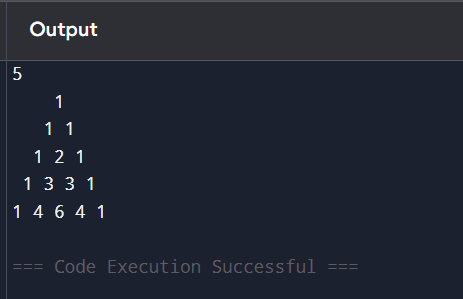

# 🔺 Looping(Patterns)-Pascal's Triangle Generator in Python

This project demonstrates a simple Python program to generate **Pascal’s Triangle**, where the number of rows is provided by the user.


## 🎯 Aim

To write a Python program that generates **Pascal's Triangle** using numbers. The number of rows is accepted from the user.

---

## 🧠 Algorithm

1. Start the program.
2. Input the number of rows from the user.
3. Loop from 0 to the number of rows.
4. For each row:
   - Print appropriate spaces to shape the triangle.
   - Compute values using the formula:  
     \[
     val=val*(no.of rows - no.of val in each row)//no.of val in each row
     \]
5. Print all rows of Pascal’s Triangle.
6. End the program.

## 🧪 Program
```
n=int(input())
val=1
for i in range(1,n+1):
    for s in range(1,n-i+1):
        print("",end=" ")
    for j in range(i):
        if i==0 or j==0:
            val=1
        else:
            val=val*(i-j)//j
        print(val,end=" ")
    print()
```
## Sample Output

## Result
The python program to print pascal's triangle is executed successfully.
