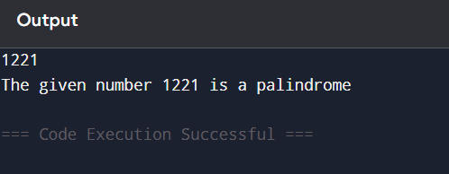

## Loops in Python: Palindrome Number Checker

## 🎯 Aim
To write a Python program that checks whether a given number is a **palindrome** using loops.

## 🧠 Algorithm
1. Get input from the user and assign it to a variable `num`.
2. Assign the value of `num` to a temporary variable `temp`.
3. Initialize a variable `rev` to 0 (used to store the reversed number).
4. Use a `while` loop to reverse the digits:
   - While `temp > 0`:
     - `rev = (10 * rev) + temp % 10`
     - `temp = temp // 10`
5. After the loop, compare `rev` with `num`:
   - If equal, print that the number is a palindrome.
   - Else, print that it is not a palindrome.

## 🧾 Program
```
n=int(input())
temp=n
rev=0
while temp>0:
    d=temp%10
    rev=(rev*10)+d
    temp//=10
if n==rev:
    print(f"The given number {n} is a palindrome")
else:
    print(f"The given number {n} is not a palindrome")
```
## Output

## Result
The python program to check whether the given number is a palindrome number is executed successfully.